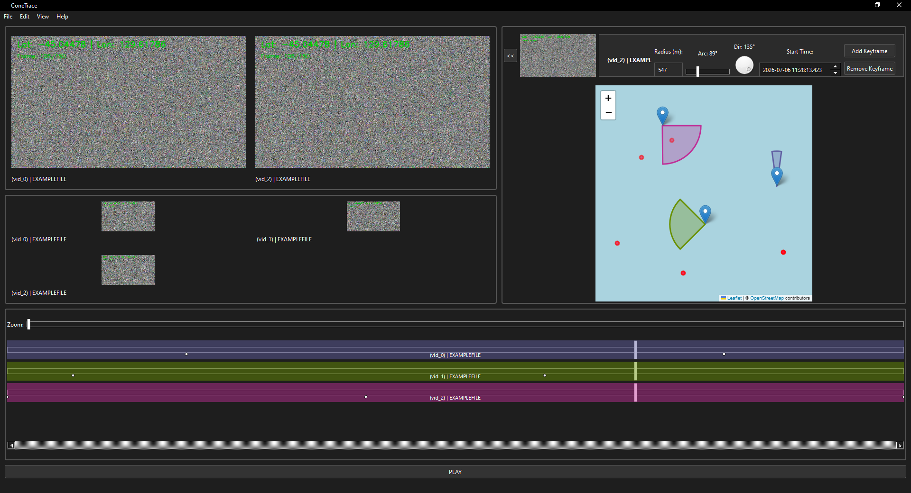

# ConeTrace
ConeTrace Forensics is a software written by Florian Kleint for his bachelor thesis about the ***design and prototypical implementation of a metadata-based analysis interface for correlating heterogeneous media data relating to major incidents***

A version of the final paper can be found in here. (not yet tho)

## Third-Party Software Notices
This application bundles a pre-compiled, unmodified binary of ffmpeg and ffprobe, which is part of the FFmpeg suite.
FFmpeg/ffprobe is licensed under the GNU General Public License v3 (GPLv3).

You can download the exact, corresponding source code for this version of FFmpeg directly from the official repository at: https://ffmpeg.org/download.html or view its license at https://www.gnu.org/licenses/gpl-3.0.html